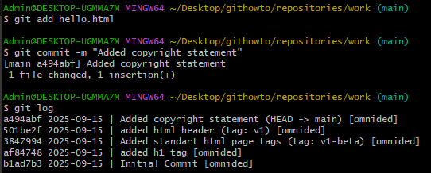
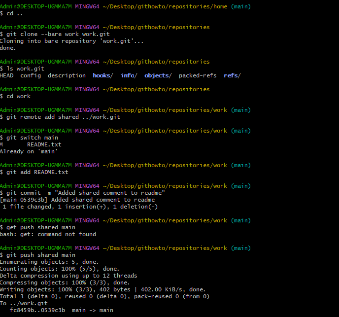

### Мінімальні вимоги (Частина 1)
Пройдено всі базові операції:
- Ініціалізація репозиторію (`git init`).
- Додавання файлів (`git add`).
- Створення комітів (`git commit`).
- Перегляд історії (`git log`, `git show`).
- Скасування змін (`git reset`, `git checkout`).
- Робота з гілками (`git branch`, `git checkout`, `git merge`).

### Розширений рівень (Частина 2)
Додатково виконано:
- Злиття гілок (`git merge`).
- Вирішення конфліктів.
- Використання тегів (`git tag`).
- Робота з віддаленим репозиторієм (`git remote add`, `git push`, `git pull`).

### Зображення виконаного курсу

 

 

 

 

 

 

 

 

 

 

 

 

 

 

 

 

 

 

 

 

 

 

 

 

 

 

 

 

 

 

 

 

 

 

 

 

 

 

 

 

 

 

 

 

